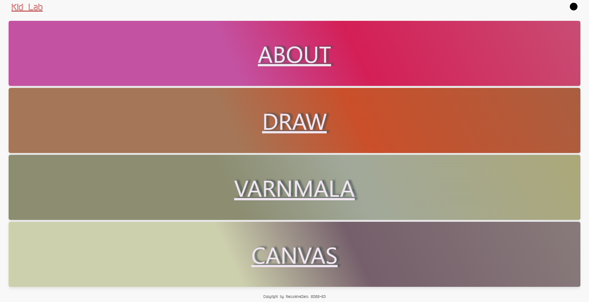
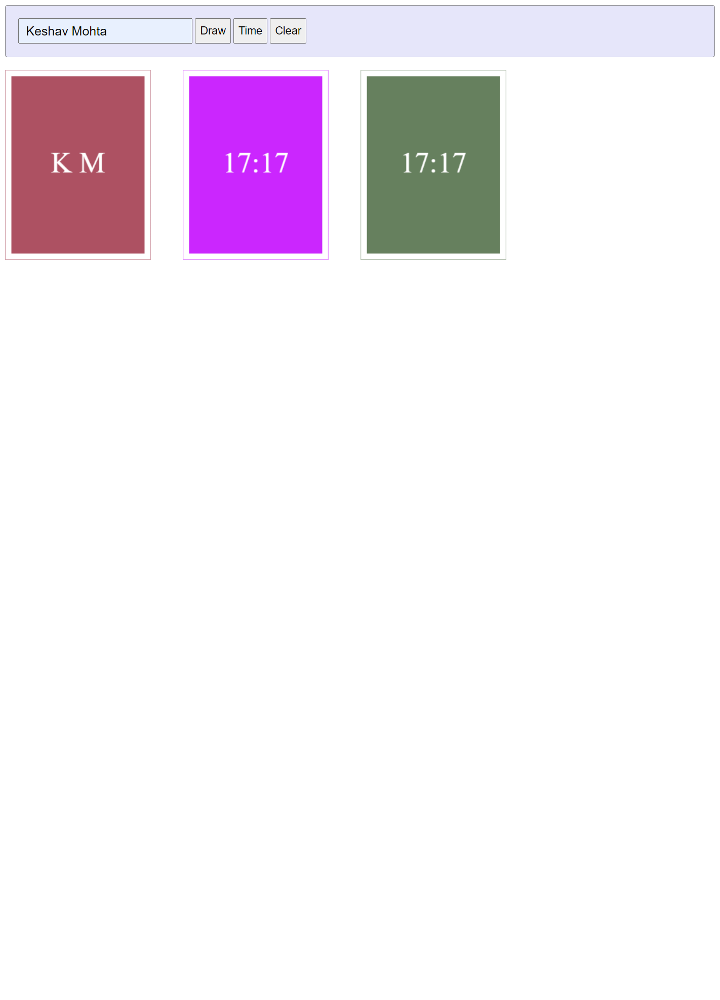

# What is this

Simple kids learning web app which change the background image/color on the key pressed.

all images are placed on `images/background` folder

_bg.json_ has mapping of those images and keys which fetched using mock API

## How to run

- clone this repo and navigate to folder and run

  `npm install`

- build client and server using webpack by running

  `npm run buildDev`

- start the app

  `npm run start`

- run below in another terminal instance

  `npm run mock-server`

> open [localhost:3003](http://localhost:3003) to see the main page in browser

## screenshot

### landing page

### Canvas

### Varnmala

### Draw

## How it works

### Draw Page

user press any key

on right side that key name will be appeared in white color with big font size

- if this key is a number than background-color will change and that number of circle appears which key is pressed.
  for eg. if 3 is pressed than 3 circle will appears.

- if this key is any alphabet than background Image will be changed to that background.
  for eg if user press A than background image will be changes to Apple.
  Note: all images are in _.jpg_ format only.

### Varnmala Page

there is grid of green blocks of 26 letters

kid type any letter from keyboard, then that block will be display the text and if type same letter again then it disappears again

### Canvas page

kid can generate image of the initial of the text entered in input box with new background every time or kid can print current time by click on time button.

we can save the image via right click of generated image
