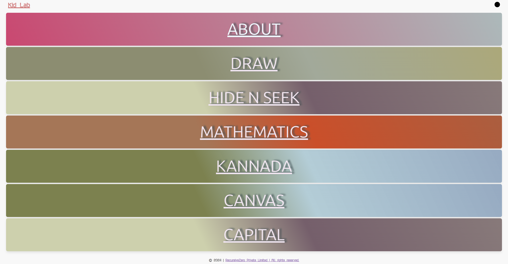
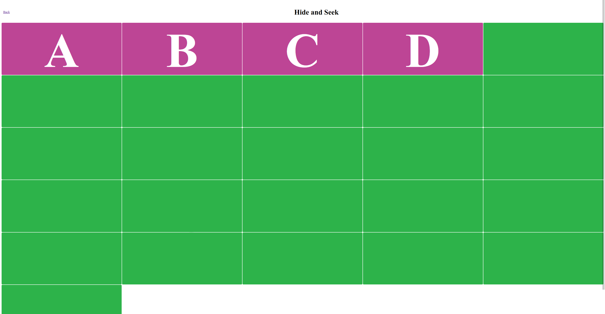
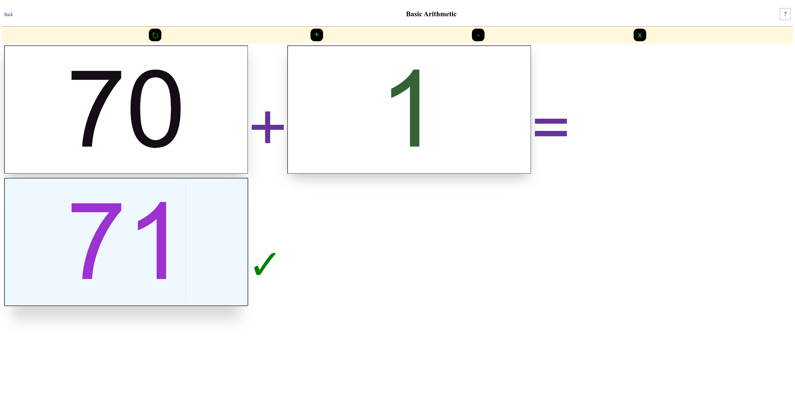
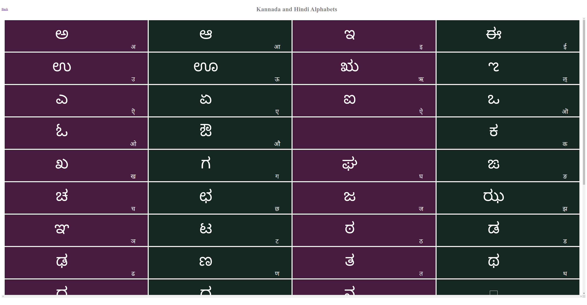
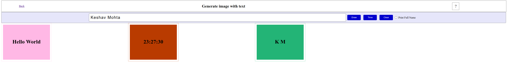
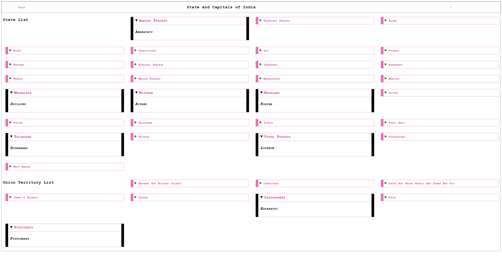

# Canvas

A learning website for kids who started their journey to learn alphabets, you can play it on a device which have keyboard such as desktop/laptop  

## Live Website

> [!NOTE]  
> website is live at [*abcd kbd.com*](https://abcdkbd.com)

## How to run

- clone this repo and navigate to folder and run

```sh
  > npm install
```

- build client and server using webpack by running

```sh
  > npm run build
```

- start the app

```sh
  > npm run start
```

open [localhost:3003](http://localhost:3003) to see the main page in browser

## screenshot

### Main page

[](https://abcdkbd.com)

### Draw

[](https://abcdkbd.com/draw)

### Hide N Seek

[](https://abcdkbd.com/hide-n-seek)

### Mathematics

[](https://abcdkbd.com/math)

### Kannada

[](https://abcdkbd.com/kannada)

### Canvas Page

[](https://abcdkbd.com/canvas)

### Capital

[](https://abcdkbd.com/capital)

## How it works

### Draw Page

user press any key

on right side that key name will be appeared in white color with big font size

- if this key is a number than background-color will change and that number of circle appears which key is pressed.
  for eg. if 3 is pressed than 3 circle will appears.

- if this key is any alphabet than background Image will be changed to that background.

for eg if user press A than background image will be changes to Apple.
Note: all images are in *.jpg* format only.

### Hide N Seek Page

there is grid of green blocks of 26 letters

kid type any letter from keyboard, then that block will be display the text and if type same letter again then it disappears again

### Mathematics page

Basic mathematics operation up to 2 digits and on refresh icon; get new data and if kid solve it then green tick will appears; there are Addition / Subtraction and Multiply operations on the page

### Kannada Page

Kannada and its relevant Hindi letter so that parent /kid can read and practice

### Canvas page

kid can generate image of the initial of the text entered in input box with new background every time or kid can print current time by click on time button.

we can save the image via right click of generated image

### Capital page

India's All State and UT Capital mentioned. when click on any State/ its capital display below that.

> [!CAUTION]
> changes in CSS and JS are hot reloaded but not HTML; for that build and run again
